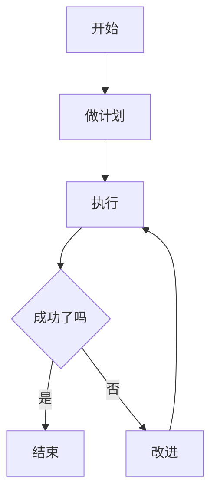
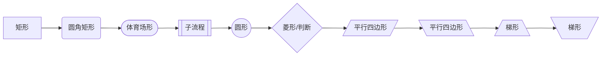
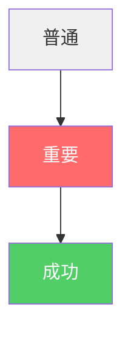
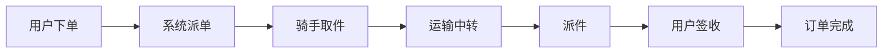
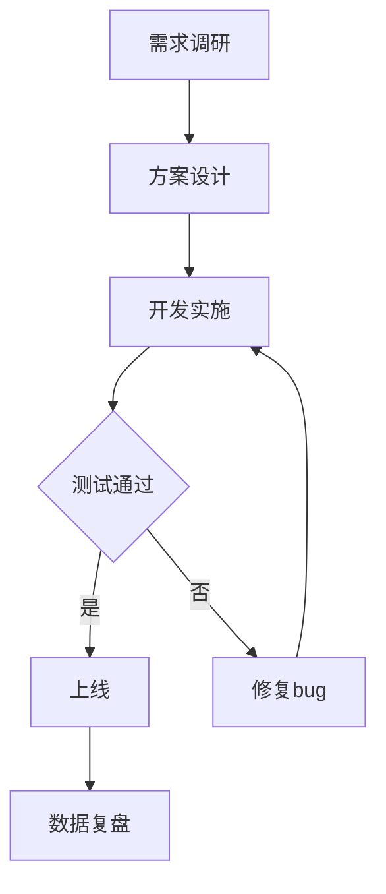
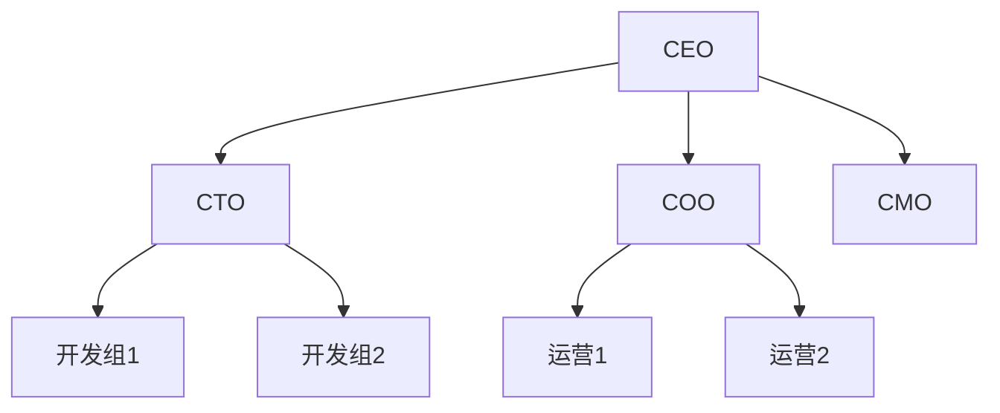
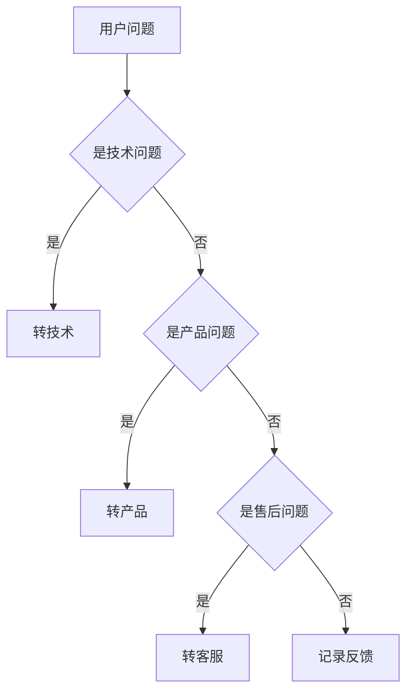
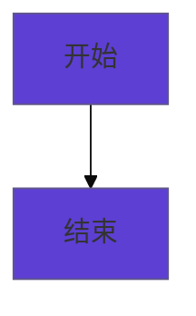
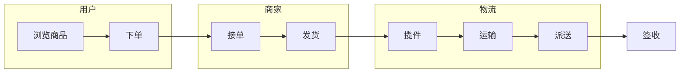

# Mermaid 5分钟速成教程

> 群面画图最快、最专业、最容易上手的工具

## 什么是 Mermaid？

```
Mermaid = 用文字描述流程图
       = 写代码 → 自动出图
       = 大厂内部技术文档标准
       = Obsidian 原生支持
```

## 5分钟学会基础

### 1. 最简单的流程图

````markdown

````

**效果**：
```
A[开始] → B[做计划] → C[执行] → D{成功了吗}
                                          ├→ E[结束]
                                          └→ F[改进] → C
```

### 2. 方向控制

```
graph TD    从上到下
graph LR    从左到右
graph BT    从下到上
graph RL    从右到左
```

### 3. 节点形状

````markdown

````

**最常用的4种**：
- `A[文字]` 普通矩形
- `A(文字)` 圆角矩形
- `A{文字}` 菱形（判断）
- `A([文字])` 体育场形（开始/结束）

### 4. 箭头

```
A --> B      实线箭头
A --- B      实线无箭头
A -.-> B     虚线箭头
A ==> B      加粗箭头
A -->|文字| B 带文字箭头
```

### 5. 颜色

````markdown

````

## 群面实战模板

### 模板1：业务全流程

````markdown

````

### 模板2：项目流程

````markdown


### 模板3：组织架构

````markdown


### 模板4：决策树

````markdown


## 在 Obsidian 中使用

### 步骤

1. **新建笔记** 或在现有笔记中
2. **输入代码块**：用 ` ```mermaid ` 包裹
3. **实时渲染**：Obsidian 会自动渲染成图
4. **导出图片**：右键 → "导出为PNG" / "导出为SVG"

### 代码块写法

````

````

注意是三个反引号 + `mermaid`，不是普通的代码块。

## 5个必记语法

```
1. graph TD     ← 方向
2. A[矩形]      ← 节点
3. A --> B      ← 连线
4. A -->|是| B  ← 条件
5. A{判断}      ← 菱形
```

## 进阶：让图更专业

### 主题样式

````markdown

````

### 泳道图（高级）

````markdown

````

## 工具汇总

| 工具 | 用途 | 推荐度 |
|------|------|--------|
| **Obsidian** | 写 + 渲染 + 导出 | ⭐⭐⭐⭐⭐ |
| **Mermaid Live Editor** | 在线编辑器 | ⭐⭐⭐⭐ |
| **mermaid.ink** | 在线渲染服务 | ⭐⭐⭐ |
| **draw.io** | 更精美但更复杂 | ⭐⭐⭐ |
| **Figma** | 最精美但最慢 | ⭐⭐ |

## 一句话总结

```
群面画图 = Mermaid + 5个语法
        = 5分钟上手
        = 1行代码1个图形
        = 大厂标准
        = 改起来飞快
```

**明天群面前，把这个教程打开，照着改就能用！**
