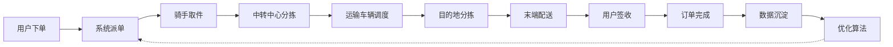
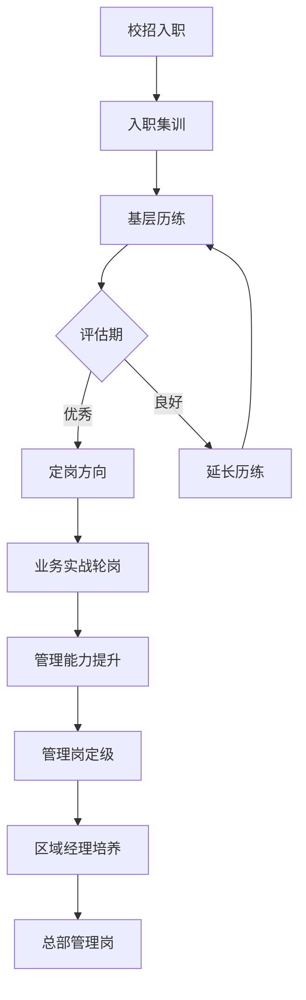
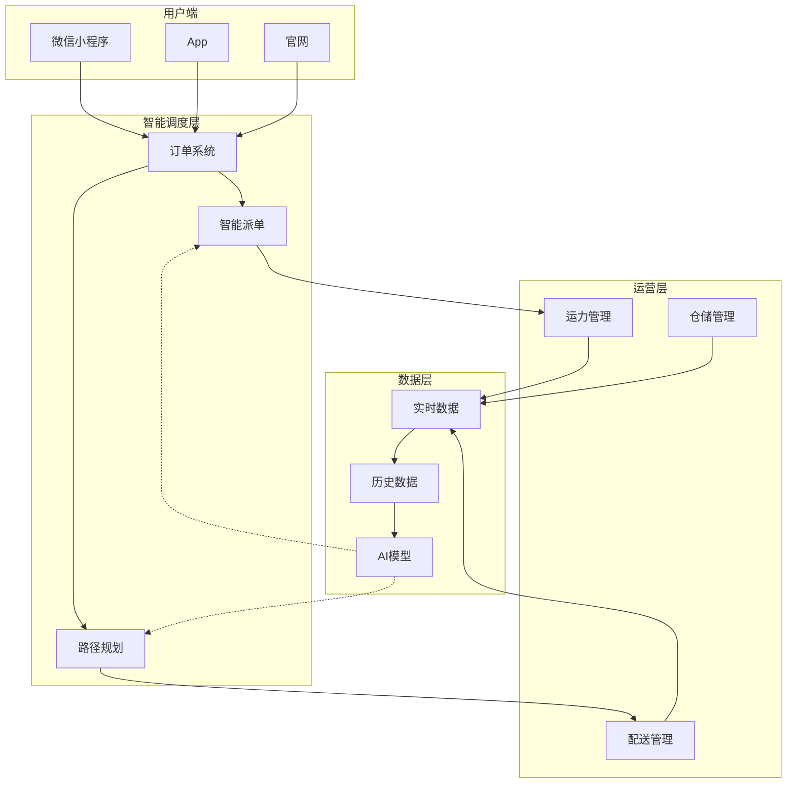
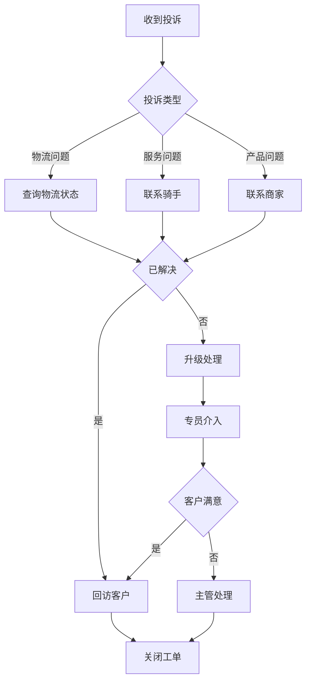
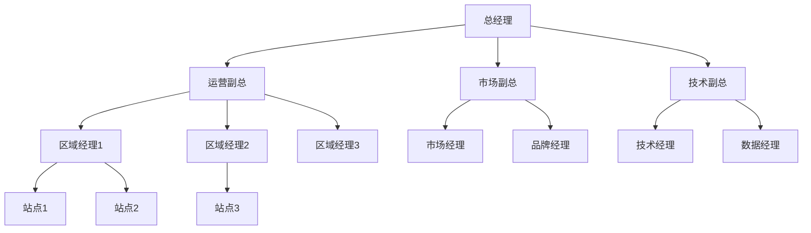
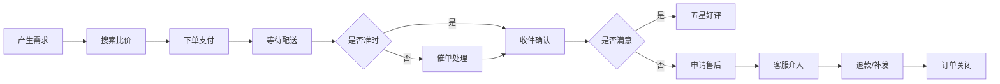
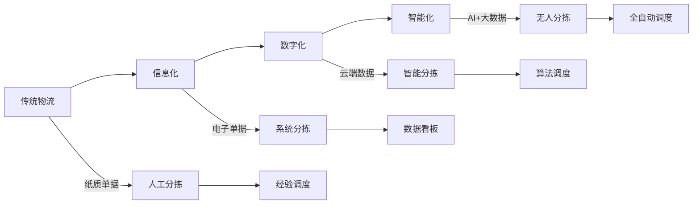
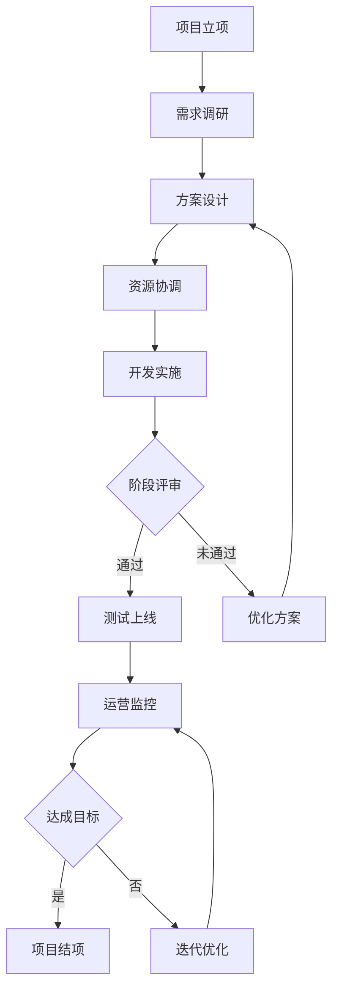
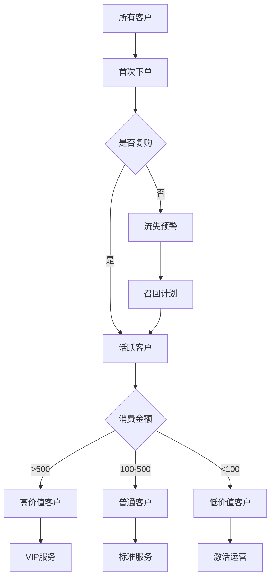
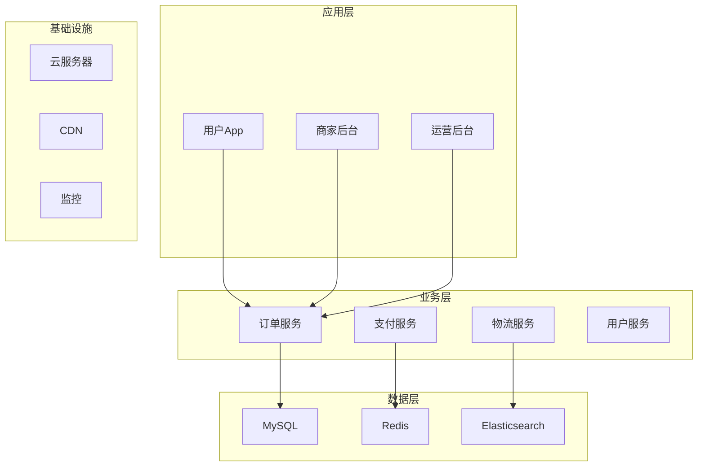

# 群面常用图模板

> 群面可能考的主题 + 对应图模板

## 模板1：物流业务流程

**适用题目**：分析顺丰的核心业务流程、设计一个物流优化方案

````markdown

````

**关键优化点**：
- 派单算法：智能匹配骑手
- 路径规划：动态最优路径
- 中转分拣：自动化分拣线
- 末端配送：无人车/无人机

## 模板2：管培生培养体系

**适用题目**：理解管培生项目、设计人才培养方案

````markdown


## 模板3：智慧物流技术架构

**适用题目**：AI/大数据在物流中的应用

````markdown


## 模板4：决策流程图

**适用题目**：客户投诉处理、问题决策类

````markdown


## 模板5：组织架构图

**适用题目**：团队搭建、部门协作

````markdown


## 模板6：用户旅程图

**适用题目**：用户体验优化、产品设计

````markdown


## 模板7：数字化转型路径

**适用题目**：传统行业如何数字化

````markdown


## 模板8：项目管理流程

**适用题目**：项目方案、流程优化

````markdown


## 模板9：客户分层运营

**适用题目**：客户运营、增长策略

````markdown


## 模板10：产品架构图

**适用题目**：产品方案、技术架构

````markdown


## 群面画图技巧

### 1. 颜色编码

- 🟢 绿色 = 成功/完成
- 🟡 黄色 = 进行中
- 🔴 红色 = 失败/警告
- 🔵 蓝色 = 决策点

### 2. 图的复杂度

- ✅ 8-15个节点：清晰
- ❌ 30+个节点：太复杂
- ❌ 3-5个节点：太简单

### 3. 群面表达话术

> "我先把整体流程画出来，然后我们分模块讨论。"

> "大家看这里，这是用户下单的主流程。"

> "我们重点优化这一段——分拣环节。"

> "如果用AI优化这个流程，可以参考这个图..."

## 群面加分话术

### 主动画图的人设

> "我比较擅长梳理逻辑，让我先画个图把大家的想法统一一下。"

### 解释图时

> "大家看这张图，我们其实在讨论三个层面：用户层、平台层、商家层。"

### 总结时

> "我把这轮的讨论画成这张图，大家看看有没有遗漏。"

## 实战建议

1. **5分钟内画完**：不要纠结细节
2. **用A4纸或大白纸**：群面通常有纸笔
3. **数字标号**：方便讨论时引用
4. **关键节点加粗**：突出重点
5. **每张图配一句话总结**：方便面试官理解
