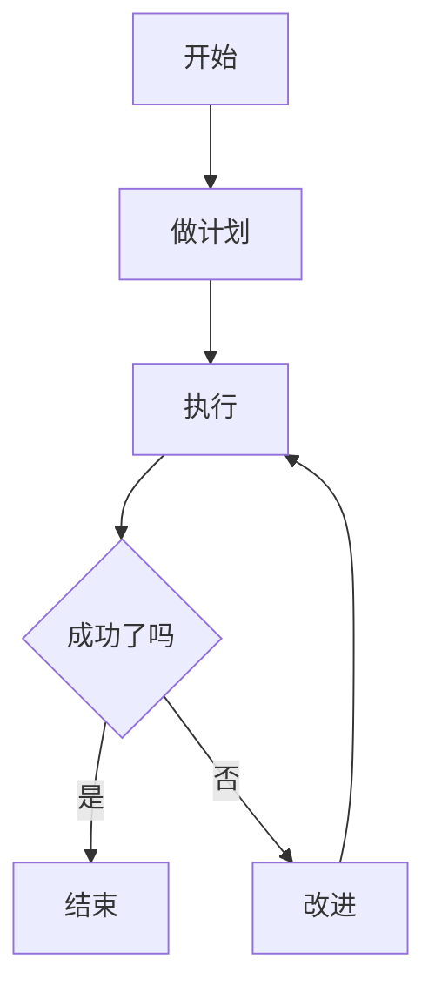

# 让 AI 帮你画图

> 把群面题目发给AI，让AI生成Mermaid代码，复制到Obsidian就出图

## 推荐AI工具

| AI工具 | Mermaid支持 | 推荐度 |
|--------|------------|--------|
| **ChatGPT** | ✅ 支持 | ⭐⭐⭐⭐⭐ |
| **Claude (我)** | ✅ 支持 | ⭐⭐⭐⭐⭐ |
| **通义千问** | ✅ 支持 | ⭐⭐⭐⭐ |
| **文心一言** | ✅ 支持 | ⭐⭐⭐⭐ |
| **Kimi** | ✅ 支持 | ⭐⭐⭐⭐ |
| **DeepSeek** | ✅ 支持 | ⭐⭐⭐⭐ |

**建议**：在手机上用AI，**问完直接复制Mermaid代码到Obsidian**。

## 通用 Prompt 模板

把以下内容发给AI：

```
你是群面画图专家。请帮我在群面中画一张流程图/架构图。

【题目】
（粘贴群面讨论的主题）

【我的角色】
（你是Leader/记录员/时间控制/创意贡献者）

【讨论内容】
（已经讨论出的要点）

【要求】
1. 用 Mermaid 语法（graph TD/LR 都可以）
2. 节点控制在 10-15 个
3. 用颜色区分模块（重要节点、成功节点、失败节点）
4. 加上判断分支（菱形节点）
5. 配上 1-2 句话的总结，方便我群面时直接讲

【输出格式】
1. 先讲设计思路（30字以内）
2. 给出完整 Mermaid 代码
3. 给出 1 句话总结
```

## 实战Prompt 1：物流优化

```
你是群面画图专家。

【题目】
设计一个方案，提升顺丰"最后一公里"配送效率。

【讨论内容】
1. 智能快递柜布局优化
2. 无人车/无人机配送
3. 社区团购合作
4. AI预测用户取件时间
5. 配送员激励机制

【要求】
1. 用 Mermaid 语法，graph TD 方向
2. 8-12个节点
3. 节点控制清晰，分模块展示
4. 用颜色区分（普通流程/AI优化点/创新方案）
5. 加上判断分支

【输出】
1. 30字内的设计思路
2. 完整 Mermaid 代码
3. 1 句话总结
```

## 实战Prompt 2：管培生项目

```
你是群面画图专家。

【题目】
设计一个针对应届生的管培生培养方案（顺丰版）。

【要求】
1. 包含：入职集训、基层历练、轮岗、考核、定级
2. 用 Mermaid 语法
3. 体现培养路径和关键节点
4. 用颜色区分不同阶段

【输出】
完整代码 + 设计思路 + 总结
```

## 实战Prompt 3：投诉处理

```
你是群面画图专家。

【题目】
设计一个客户投诉处理流程，提升客户满意度。

【要求】
1. 涵盖：投诉分类、处理流程、升级机制、回访
2. 用 Mermaid 语法
3. 加上判断节点（满意度评估）
4. 闭环流程

【输出】
完整代码 + 总结
```

## 实战Prompt 4：数字化转型

```
你是群面画图专家。

【题目】
画一个传统物流公司数字化转型的路径图。

【要求】
1. 体现：信息化 → 数字化 → 智能化 的演进
2. 用 Mermaid 语法
3. 每个阶段的关键技术
4. 颜色区分阶段

【输出】
完整代码 + 总结
```

## 拿到代码后怎么处理

### 步骤1：复制Mermaid代码

AI会给你类似这样的输出：

````markdown

````

### 步骤2：粘贴到Obsidian

1. 打开Obsidian
2. 找到 `06-面试准备/群面流程图速成/群面图库.md`
3. 粘贴代码块
4. Obsidian 自动渲染

### 步骤3：导出图片

- 右键图片 → "导出为 PNG"（建议）
- 或 "导出为 SVG"（无损）

### 步骤4：发送/打印

- 截图发到群面群
- 或打印出来带到现场

## Obsidian 群面图库

把所有AI生成的图都保存在一个文件里，群面前快速翻阅。

文件位置：`06-面试准备/群面流程图速成/群面图库.md`

格式：

```markdown
# 群面图库

## 图1：物流优化方案
> 来源：群面讨论
> 使用时间：2026-05-31 顺丰群面


## 图2：管培生项目
> 来源：群面讨论
> 使用时间：2026-05-31 顺丰群面


```

## 群面前30分钟快速准备

1. **打开 `群面图库.md`**
2. **根据题目挑 1-2 张相关图**
3. **微调内容**（根据群面讨论）
4. **导出 PNG / 打印**

## 应急方案

如果AI生成的不是你想要的，**直接修改Mermaid代码**：

```mermaid
原图：
A[用户] --> B[下单]
B --> C[支付]
```

```mermaid
修改：
A[用户] --> B[登录]
B --> C[选商品]
C --> D[下单]
D --> E[支付]
```

**改几个字就行，1分钟搞定！**

## 一句话总结

```
群面画图 = AI 生成 Mermaid 代码
         → 复制到 Obsidian
         → 自动渲染成图
         → 导出图片 / 打印
         → 群面展示

5分钟出图，专业度拉满！
```

## 明天顺丰群面的准备路径

1. **今天晚上**：在 Obsidian 创建 `群面图库.md`
2. **根据猜测的群面主题**，生成 3-5 张图
3. **群面前30分钟**：挑选 + 微调 + 导出
4. **群面中**：纸笔画图 + 展示导出图（如果有屏幕）

祝你明天群面顺利！🎉
