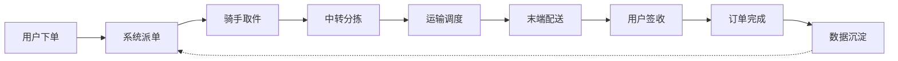
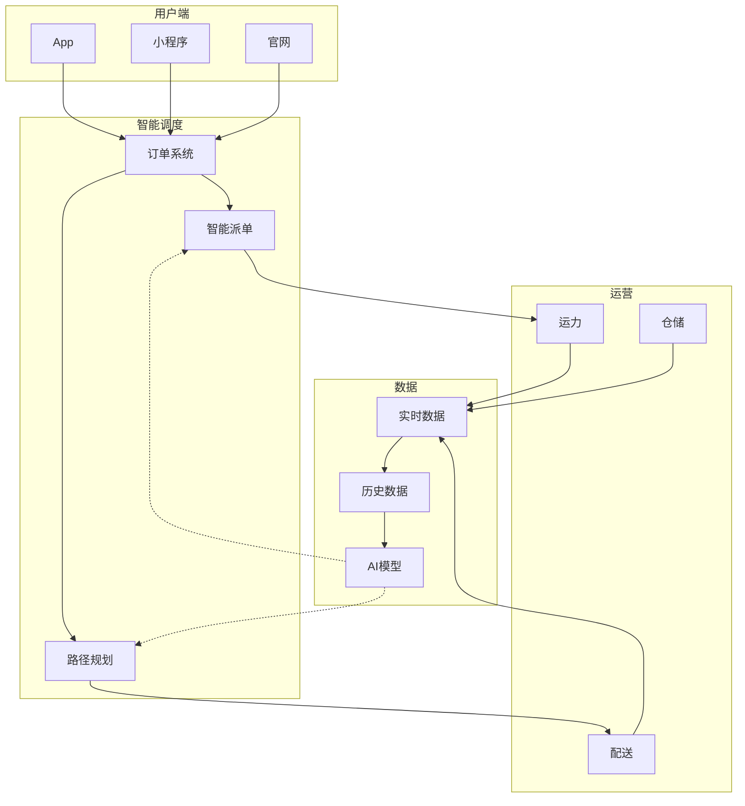
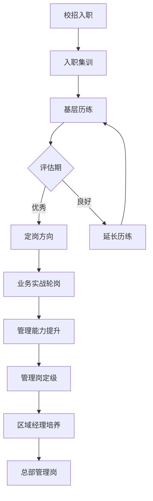
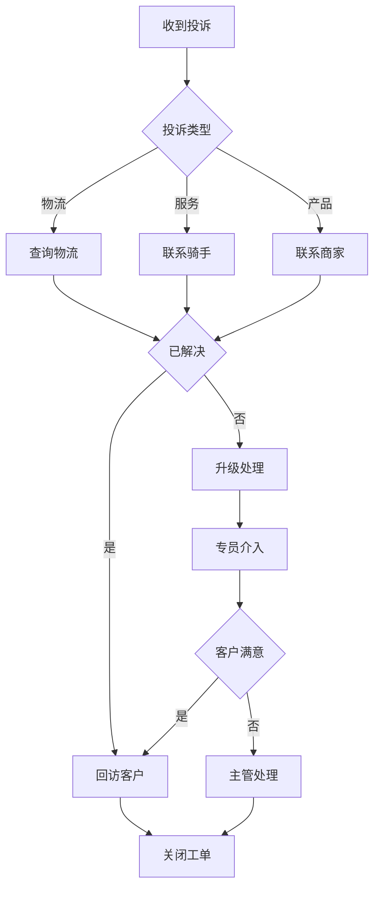
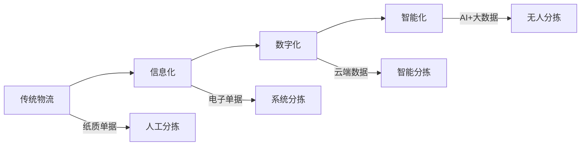
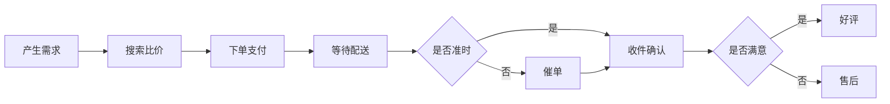
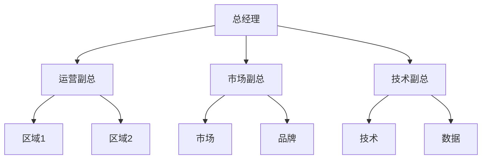
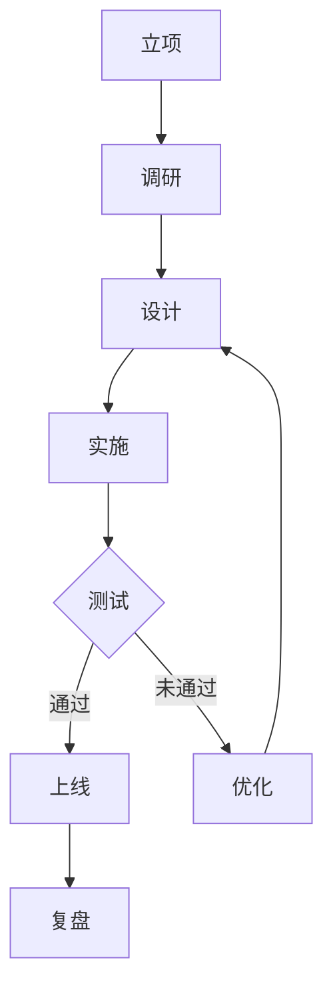
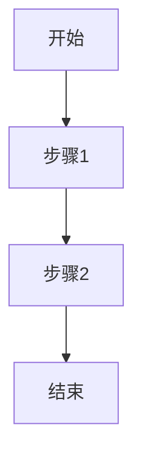

# 群面图库

> 这里存放所有群面可能用到的流程图
> 群面前 30 分钟快速翻阅，挑图 + 微调

## 使用方法

1. 找到对应主题的图
2. 微调文字内容
3. 导出 PNG / 打印 / 屏幕展示

---

## 图1：物流全流程（基础版）

> 适用：物流业务流程分析
> 创建时间：2026-05-31

---

## 图2：智慧物流技术架构

> 适用：AI/数字化在物流中的应用

---

## 图3：管培生培养路径

> 适用：人才培养、项目设计

---

## 图4：投诉处理流程

> 适用：客户运营、流程优化

---

## 图5：数字化转型路径

> 适用：传统行业转型

---

## 图6：用户旅程

> 适用：用户体验、产品设计

---

## 图7：组织架构

> 适用：团队搭建

---

## 图8：项目管理流程

> 适用：项目方案

---

## 快速添加新图

直接复制以下模板：

修改节点和连线即可。
